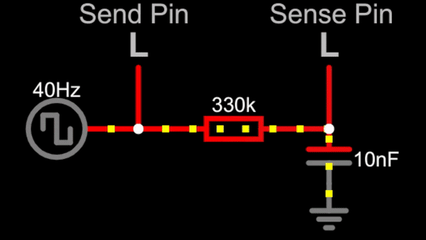

# KappaPad

KappaPad is a two-button keypad intended for playing osu!. Unlike other keypads with mechanical switches, KappaPad has fixed metal pads and uses capacitive sensing to determine when they are being pressed. Because there is no key travel, one can minimize the distance their fingers move to conserve stamina during long streams.

## How it works

* It uses capacitive sensors, the same kind of sensor your phone uses!
* Here is a GIF that explains it

* Notice the delay between when the send pin is high to when the sense pin is high
* That delay is what the keypad times, it counts the ammount of cpu cycles it takes for the pin to be high
* the 10nF capacitor to ground simulates your finger, if this wasnt there then there would almost no delay 

## How to Make One
### Electronics

* Breadboard
* Compatible board (check `src` folder to see what MCU/Boards are supported)
* 2x 330 kOhm Resistor (or similar)
* Solid-Core Wire
* 2 Pads (Can be aluminum, coins, whatever)

### Building/Use

* Check the [list of compatible MCU/Boards](./src/).
* Click the MCU/Board you want to use and read the instructions on how to build/use it

## Contributing

See [`CONTRIBUTING.md`](./CONTRIBUTING.md).
