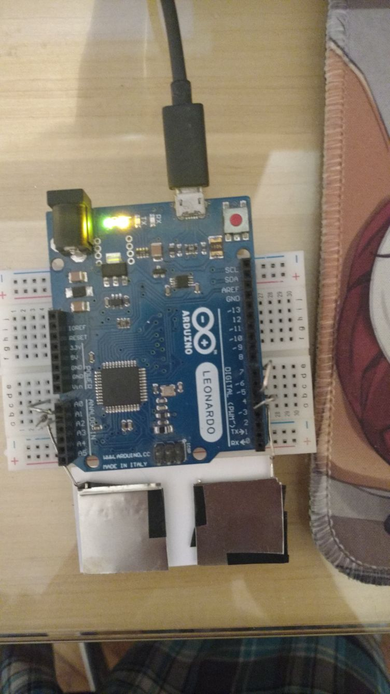
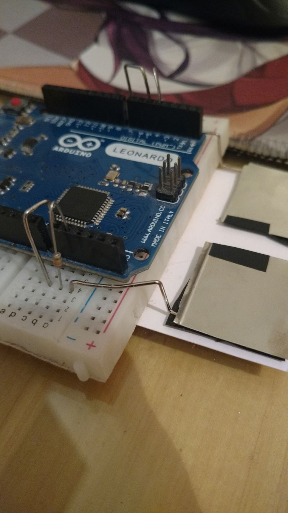
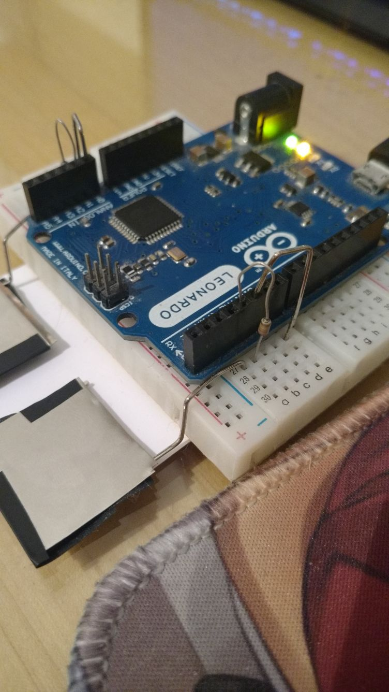

# KappaPad

KappaPad is a two-button keypad intended for playing osu!. Unlike other keypads with mechanical switches, KappaPad has fixed metal pads and uses capacitive sensing to determine when they are being pressed. Because there is no key travel, one can minimize the distance their fingers move to conserve stamina during long streams.

## Usage

Just plug the KappaPad into a computer, and it should work as a USB keyboard

## How to Make One

Here is an example of how to build one, but you don't have to follow it exactly. Just use the materials you have on hand.

### Electronics

* Breadboard
* Arduino Leonardo (or any ATMega32u4 board)
* 2x 330 kOhm Resistor
* Solid-Core Wire
* 2 aluminum sheets

All of the electronics were connected by a small breadboard. An Arduino Leonardo was used. Other boards that can act as a USB keyboard can be used, such as Arduino Pro Micro, Arduino Zero, Arduino Due, and Teensy.

### Software

The Arduino Sketch is located in the KappaPad directory of this repository.

* **Change the pins and keys you will use in `config.h`.**
* **If your board doesn't have onboard LED on pin 13, you can change it to custom LED or proper onboard LED**

# **IF YOU ARE GONNA CHANGE KEYS, ONLY LOWERCASE ENGLISH ALPHABET IS SUPPORTED FOR OPTIMIZATIONS (a-z)**

Upload the sketch to the board using the appropriate board type. (Use Arduino Leonardo if you have a Pro Micro.) After uploading, note that your board may recieve a different serial port number.

At this point the keyboard may work, or the threshold values may have to be adjusted. If keys act like they are being held down and your computer is now unusable when the keypad is plugged in, Comment the line that says `Keyboard.press(key);` inside `CapacitiveKey.h`  and enable serial output by uncommenting `SERIAL_OUTPUT` in `config.h`, that will show you the threshold the sensor is now, put it 1+ to the highest value you see when not touching the pads, disable serial output again to improve performance.
