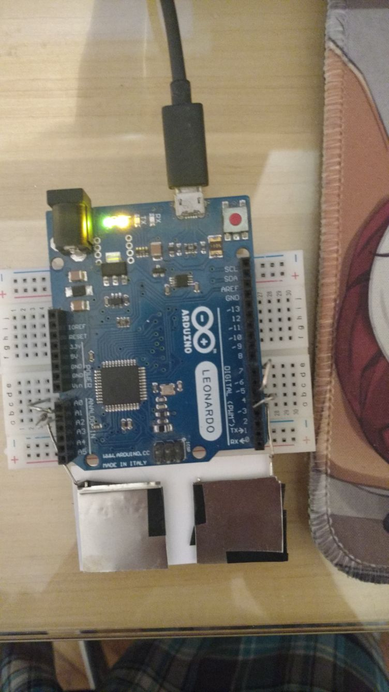
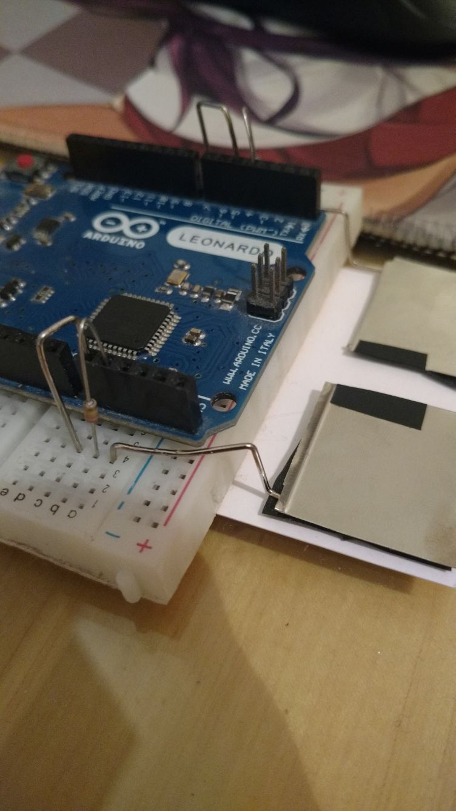
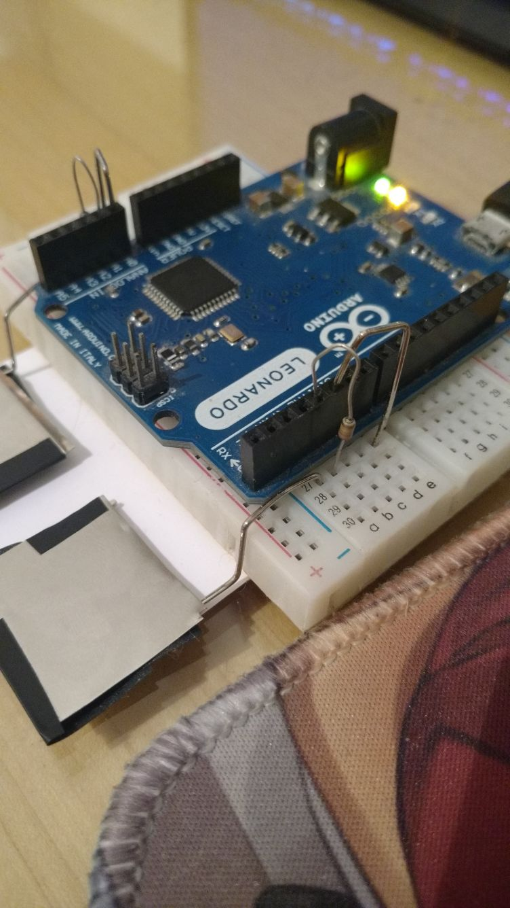

# Kappa-Pad for the ATMega32u4

## Components
### Components are the default ones (See components of [`README.md`](../../README.md).)

## Building/Using

### Linux/Windows
* Clone this repo
* cd into `src/ATMega32u4`
* Read and edit the `config.h` file
* Upload using the Arduino IDE or edit and exec the .sh files if you want to use the CLI
* ~~Use?~~

## Pictures

|                                        |                                          |                                           |
| :------------------------------------: | :--------------------------------------: | :---------------------------------------: |
|  |  |  |