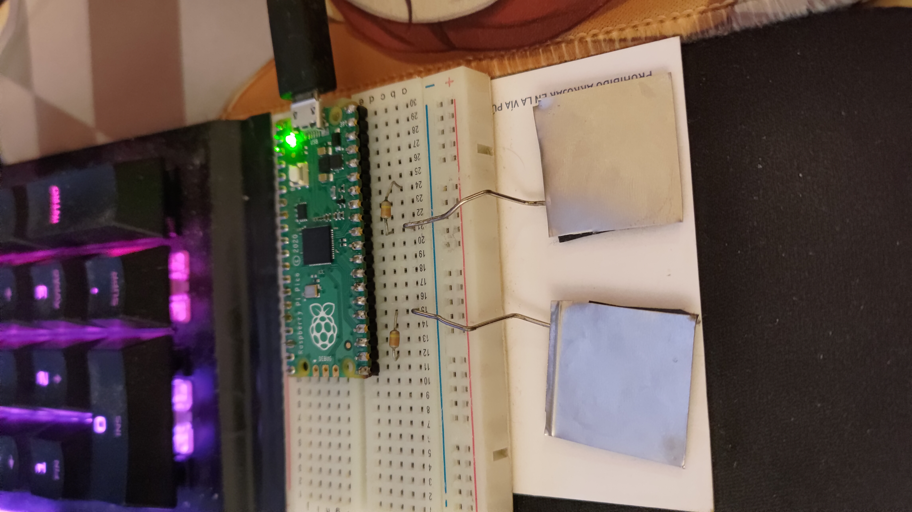

# Kappa-Pad for the Pico (RP2040)

## Components
### Components are the default ones (See components of [`README.md`](../../README.md).)

## Building/Using

### Linux
* Clone this repo
* cd into `src/Pico`
* Read and edit the `config.h` file inside the `src` folder
* make a directory called `build` inside the `Pico` folder and cd into it
* do `cmake ..`
* do `make`
* The uf2 file should be in that build folder, copy it to the Pico
* ~~Use?~~

## Pictures

|                                           |
| :---------------------------------------: |
|  |